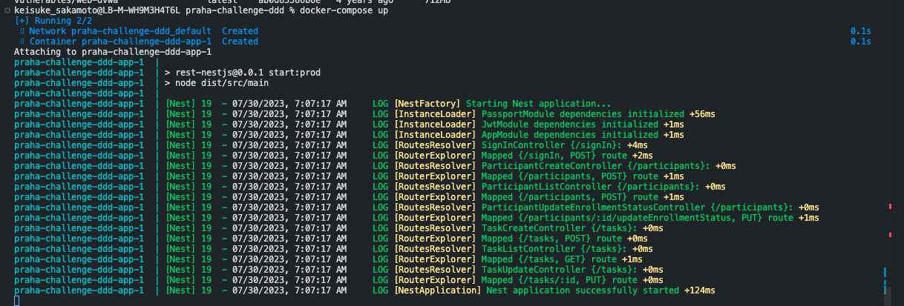

# 課題 1（質問）

## Docker とは

- Docker とは、ソフトウェア開発で用いられるツールの一つで、コンテナという技術を使ってアプリケーションの開発、テスト、デプロイを行う。
- コンテナとは、ソフトウェアとその動作に必要な全ての依存関係をパッケージ化し、一貫した環境を作る技術。つまり、コンテナに入っているアプリケーションは、どの環境でも同じように動作する。
- Docker は、このコンテナ技術を使いやすくするためのツール。具体的には、コンテナの作成、起動、停止などをコマンド一つで行うことができる。

## イメージ

- Docker イメージは、コンテナを実行するためのテンプレート。これにはアプリケーションコード、ランタイム、ライブラリ、環境変数、設定ファイルなど、アプリケーションが実行するのに必要な全てが含まれている

## コンテナ

- コンテナは Docker イメージから実行された実行中のインスタンス。コンテナ化により、アプリケーションは独立して動作し、他のコンテナやホストシステムと隔離される。

## ベースイメージ

- ベースイメージは Docker イメージを作成する際のスタートポイントとなるイメージ
- 通常、ベースイメージはオペレーティングシステム（Ubuntu や Alpine など）を含むが、それに加えて特定のフレームワークやランタイム（Node.js や Python など）を含むものもある。

## Docker レジストリ

- Docker レジストリは Docker イメージの格納場所で、Docker Hub や Google Container Registry などが一般的
- レジストリからイメージを pull(取得)したり、自分が作成したイメージを push(アップロード)したりする

## ビルドコンテキスト

- Docker のビルドコンテキストは、Docker イメージをビルドする際に、Docker デーモンが参照できるファイル群を指す
- これは通常、Dockerfile が置かれているディレクトリとそのサブディレクトリに含まれるファイルすべてを指す

## マルチステージビルド

- マルチステージビルドは Docker イメージを効率的に作成するための手法で、一つの Dockerfile 内で複数のビルドステージ（一連の命令を含む一時的な中間イメージ）を使用する
- これにより、最終的なイメージのサイズを小さく保ちつつ、ビルドやテストなどの過程で必要なツールやファイルを使用できる

## Dockerfile を作成して環境構築をコード化するメリット

### 再現性

- Dockerfile にはアプリケーションが実行するために必要なすべての手順が記述されている
- それにより、どんなマシン上でも同じ環境を容易に作り出すことが可能
- これにより、「私のマシンでは動作したけど、他のマシンでは動かない」という問題を防ぐことができる

### バージョン管理

- Dockerfile はテキストファイルなので、Git などのバージョン管理システムを用いて変更履歴を追跡することができる
- これにより、何が変更されたのか、いつ、誰によって変更されたのかを把握することができる

### 自動化

- Dockerfile は環境構築の手順を自動化する。そのため、新しい環境をセットアップする際に、手動で時間をかけて設定する必要がない。
- ヒューマンエラーを防ぐことができる

### 文書化

- Dockerfile を読むだけで、そのアプリケーションがどのような環境で動くのかを理解することができる

### コンテナ技術の活用

- Dockerfile を用いることで、コンテナの技術をフルに活用することができる
- それにより、複数のアプリケーションを同一のマシン上で独立して実行でき、リソースの利用を効率化することができる
- また、コンテナを使うことで、アプリケーションのデプロイやスケーリングが容易になる

## docker-compose のメリット

docker Compose は、複数の Docker コンテナを一度に管理し、それらを連携させるためのツール

### マルチコンテナアプリケーションの簡易管理

- Docker Compose は複数のコンテナで構成されるアプリケーションの起動、停止、再起動を一元管理することを可能にする。これにより、各コンテナを個別に管理する手間を大幅に削減できる。

### 環境の再現性

- Docker Compose は YAML 形式の設定ファイル（docker-compose.yml）に、それぞれのサービス（コンテナ）の設定を記述する
- この設定ファイルを共有することで、同じ設定の環境を他のマシンでも簡単に再現することが可能

### サービス間連携の簡易化

- Docker Compose では、ネットワーキングやデータの共有など、複数のコンテナ間での連携を設定ファイルで管理できる
- これにより、サービス間の依存関係を明確にし、それらの連携を簡単に管理できる

### 環境変数の管理

- Docker Compose では、環境変数を設定ファイルで一元管理することができる
- これにより、アプリケーションの設定を柔軟に変更したり、機密情報を安全に管理したりできる

## .dockerignore にはどのようなファイルやディレクトリを含めると良いか

- .dockerignore ファイルは、Docker イメージのビルドプロセス中に無視されるべきファイルやディレクトリを指定する
- これにより、ビルドの高速化や、不要なデータがイメージに含まれるのを防ぎ、イメージのサイズを小さく保つことができる
- 以下に .dockerignore ファイルに一般的に含めるべき例をいくつか挙げる

### ログファイルや一時ファイル

- これらは大きな容量を占める可能性があり、アプリケーションの実行には不要

### 依存関係のキャッシュ

- node_modules/ や vendor/ など、依存関係をキャッシュするディレクトリは、アプリケーションの実行に必要だが、Dockerfile の中で npm install や composer install のようなコマンドによって作成されるべき

### ビルド成果物

- ビルドプロセスで生成される成果物やバイナリ。これらは通常、Dockerfile の中で生成されるべき

### バージョン管理システムのディレクトリ

- .git/, .svn/ など。これらのディレクトリは開発時に重要だが、アプリケーションの実行には必要ない

### 環境設定ファイル

- .env や config/local.js のような環境固有の設定ファイル。これらは特定の環境に依存する情報を含んでおり、それぞれの環境で適切に設定すべき

### テストファイルやドキュメンテーション

- アプリケーションの実行には不要

## パッケージについて

- Docker はイメージを作成するときに、各命令（例えば、RUN、COPY、ADD など）に対してキャッシュを使用する
- Docker は以前に実行された同じ命令を見つけると、再度その命令を実行するのではなく、キャッシュされた結果を再利用する

Dockerfile の各行が分けられて記述されている場合

```
RUN apt-get update
RUN apt-get install [something]
```

- 最初の RUN apt-get update が一度実行されると、その結果はキャッシュされる
- 次に、その後のビルドで Docker が同じ RUN apt-get update 命令を見つけると、キャッシュされた結果を再利用する
- そのため、最新のパッケージ情報を更新することなく、古いパッケージ情報が再利用される
- 結果として、RUN apt-get install [something]は古いパッケージ情報を元にパッケージをインストールし、予期しないバージョンのパッケージがインストールされる可能性がある

一方、以下のように一行で記述されている場合

```
RUN apt-get update && apt-get install [something]
```

- apt-get update と apt-get install [something]は一緒に実行される
- それらは一つの命令とみなされ、キャッシュが一緒に効くため、apt-get update が毎回新しいパッケージ情報を取得し、apt-get install [something]はその新しい情報を元にパッケージをインストールする
- これにより、意図したバージョンのパッケージがインストールされる

## ENV について

ENV と RUN export の両方とも Dockerfile の中で環境変数を設定するために使われますが、挙動には確かに大きな違いがある

### ENV 命令

ENV 命令は Dockerfile で定義され、そのイメージから生成されるすべてのコンテナで使用可能な環境変数を設定する。
ENV によって設定された環境変数は、イメージのビルド、コンテナの実行の両方で利用でき、また ENTRYPOINT と CMD 指示子でも参照できる。

```
ENV NAME='hoge'
```

### RUN export 命令

RUN export はある RUN 命令の実行時にのみ環境変数を設定する。
この設定は、その RUN 命令のスコープ内だけで有効で、後続の RUN 命令や、コンテナ実行時には引き継がれない。

```
RUN export NAME='hoge'
```

この命令は、この RUN 命令が実行されている間だけ NAME 環境変数を設定する。
したがって、コンテナ実行時に環境変数を設定するためには ENV 命令を使用し、特定の RUN 命令の実行時に一時的に環境変数を設定する場合には RUN export を使用する。

# 課題 2（実装）

「特大課題」で作成したプラハチャレンジのアプリケーションを Docker 化

dockerfile は下記リポジトリ参照
https://github.com/motikoma/praha-challenge-ddd

docker-compose up を実行すると、下記のようにアプリケーションが起動する

